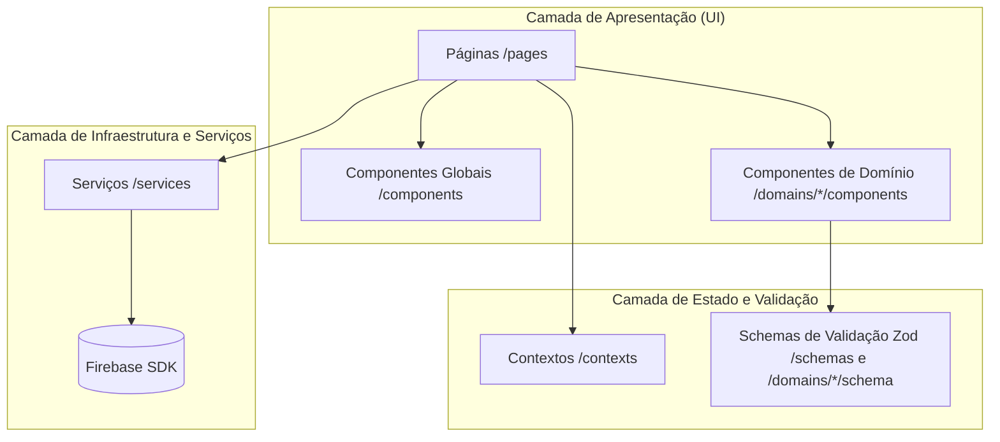
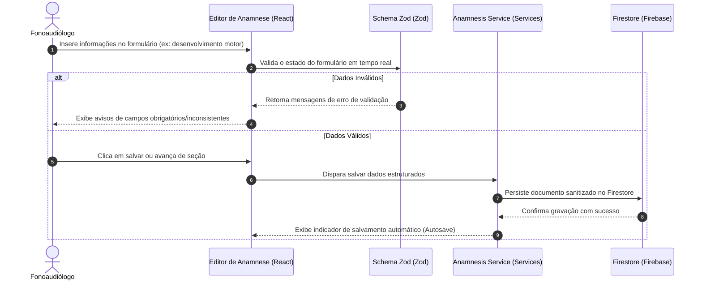

# Arquitetura e Fluxo de Dados - FonoAnamnese

Este documento descreve as decisões arquiteturais, o fluxo de dados e as diretrizes de manutenção do sistema **FonoAnamnese**.

---

## 🏛️ Visão Geral da Arquitetura

O sistema segue uma arquitetura client-side (SPA) baseada em React estruturada por **Componentes Reutilizáveis**, **Contextos de Estado**, **Serviços de Persistência** e divisões claras de **Domínios de Negócio**.

### Diagrama de Arquitetura

---

## 📂 Organização de Diretórios do Código (`src/`)

- `components/`: Componentes genéricos de UI altamente reutilizáveis e que não possuem lógica direta de negócio (ex: botões, inputs puros, cabeçalhos, `ThemeToggle`).
- `contexts/`: Provedores de estado global do React. O principal é o `AuthContext`, responsável por gerenciar a sessão ativa do usuário e expor credenciais para proteção de rotas.
- `domains/`: Divisão modular baseada nos domínios da anamnese (ex: `motor`, `language`, `pregnancy`, `speech`). Cada domínio agrupa suas próprias necessidades:
  - `components/`: Componentes específicos daquela seção.
  - `schema.ts`: Validações de entrada com Zod.
  - `types.ts`: Tipagem estática do domínio.
  - `tests/`: Testes unitários focados na lógica do domínio correspondente.
- `pages/`: Telas completas da aplicação compostas por rotas. Integram componentes de domínio com serviços de persistência.
- `services/`: Encapsula a comunicação externa, especificamente a API do Firebase (Auth e Firestore). Nenhuma página deve interagir diretamente com o Firebase SDK; toda operação é mediada por serviços (ex: `anamnesisService.ts`, `patientService.ts`).
- `utils/`: Funções puras reutilizáveis que facilitam cálculos (ex: cálculo de idade com base na data de nascimento).

---

## 🔄 Fluxo de Dados

O fluxo padrão de persistência e edição de uma anamnese segue os seguintes passos:

### Detalhes do Fluxo:
1. **Autenticação**: O `ProtectedRoute.tsx` intercepta a renderização de rotas privadas. Se a sessão no `AuthContext` estiver ausente, o usuário é redirecionado para a página de `/login`.
2. **Segurança de Acesso**: Todos os dados salvos possuem propriedade `professionalId`. As regras de segurança do Firestore garantem que um profissional logado só possa ler/escrever pacientes e anamneses que contenham o seu `professionalId`.

---

## 🛠️ Como Manter e Expandir o Sistema

Ao criar novas seções de anamnese ou recursos:

1. **Siga a Estrutura de Domínios**:
   - Crie uma subpasta em `src/domains/` para o novo assunto.
   - Desenvolva os tipos (`types.ts`) e o schema de validação (`schema.ts`) primeiro.
   - Implemente os componentes necessários e os testes unitários dentro de `tests/`.
2. **Valide com Testes**:
   - Escreva testes unitários cobrindo o estado inicial, o preenchimento de campos e a validação obrigatória dos novos formulários.
   - Rode `npm run test` e garanta que a cobertura se mantenha acima de 80%.
3. **Mantenha os Serviços Isolados**:
   - Se for necessária uma nova tabela ou coleção no Firestore, crie um método no serviço correspondente em `src/services/`. Nunca injete consultas diretas do Firestore dentro de componentes React.
